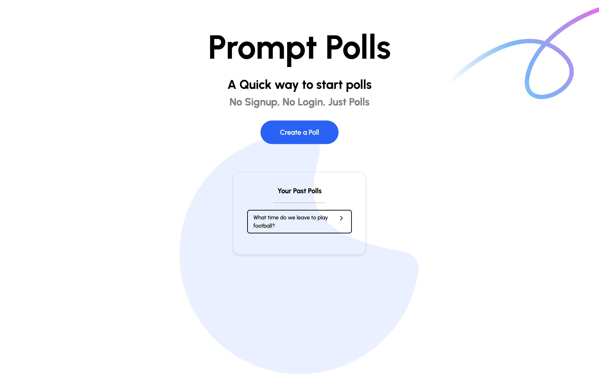
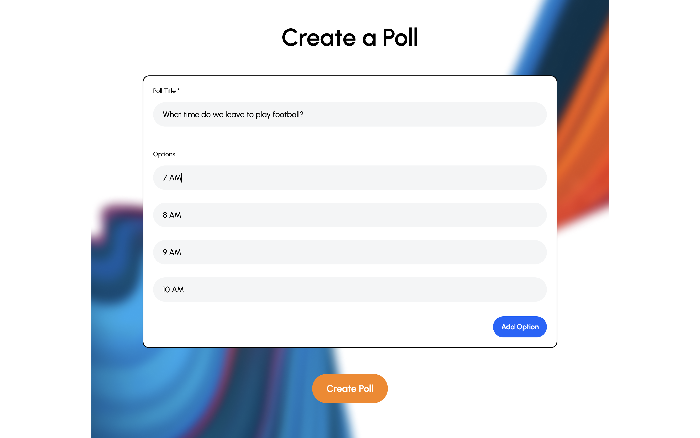
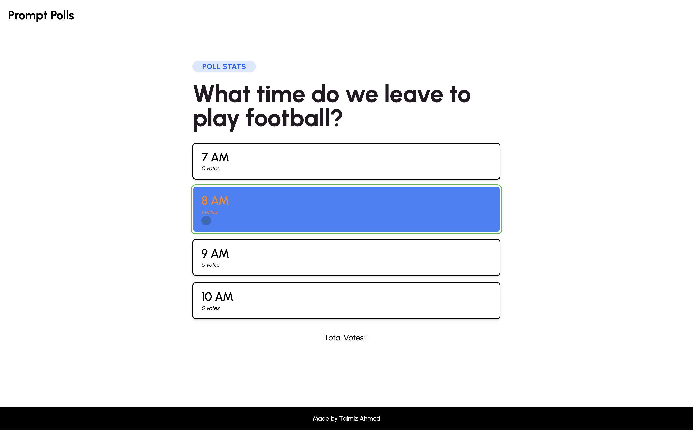

# Prompt Polls

A web service that allows you to create and vote in polls anonymously without signing up.








## Tech Stack
- Typescript
- NodeJS
- Express
- WebSockets (Socket.io)
- Prisma (ORM)
- Redis
- Postgres
- React and NextJS
- Tailwind
- Chai (for Testing)
- Docker


## Steps to run locally
Go into `/backend/.sample_env` and change the file name to `.env`. This is to ensure the backend recieves the right URLs and credentials to connect to the Postgres and Redis DBs
\
\
From the root of the project, run the following command
```
docker-compose up -d
```


## System Design Overview
Coming soon :)
